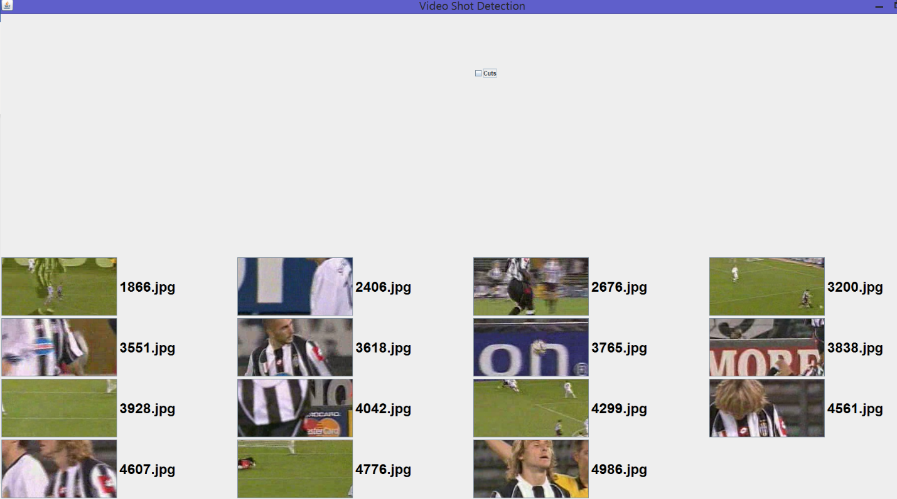
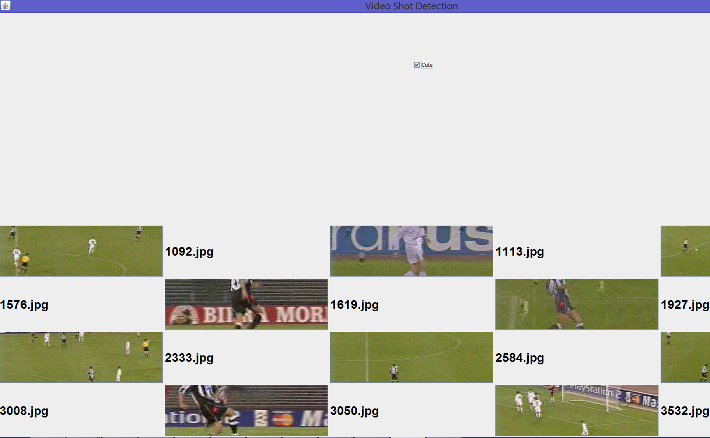
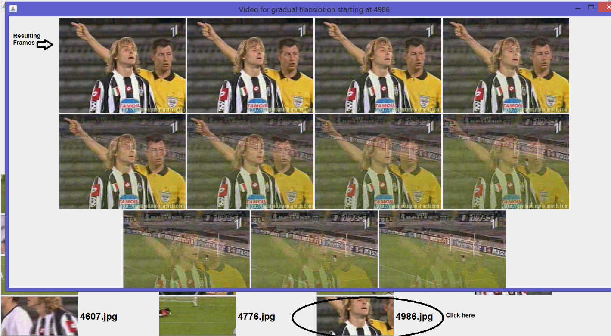
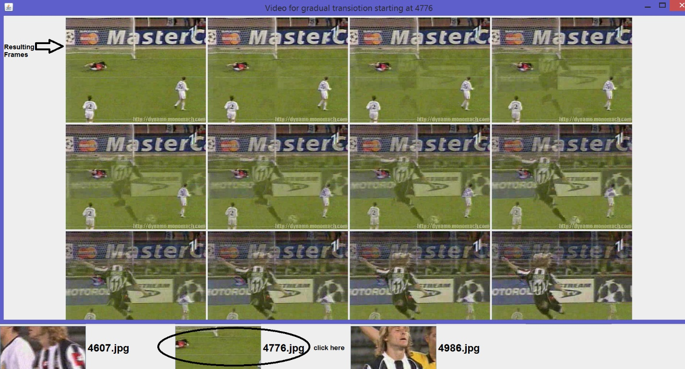
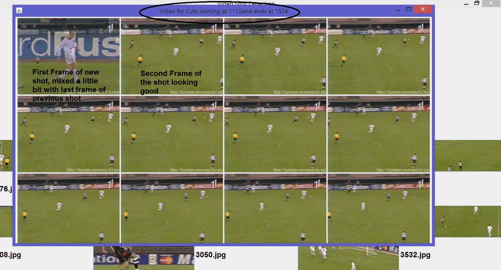

CSS 584 -- Assignment #4 Report

Option #2

Ahmed Nada

Student ID: 1875772

1.  How to run the code, how to use the system, functionalities of each
    program file

> I have included the JAR file however it looks like the library is not
> included correctly in the JAR file. Some times it worked and sometimes
> it did not. I'm also submitting the whole project directory in case
> you wanted to compile it and run it. Make sure to add the
> (opencv-420.jar) in the library of the project. I have made sure in
> the manifest file the openCV JAR file is included in the Class Path.
>
> Once the application Starts you should see the main Frame showing the
> first frame of the gradual transitions.
>
> {width="6.486111111111111in"
> height="3.6180555555555554in"}
>
> To choose viewing the cut frames, click on the check box "Cuts".
>
> {width="6.493055555555555in"
> height="4.013888888888889in"}
>
> It took me almost 4 days to try to get a library that can open and
> play the video frames but not even one worked for me for different
> issues. I have tried JMF, VLCJ and OpenCV. OpenCV works fine only if I
> seek and run the frames from the main function, once I take that
> function to the Video class, it does not re-validate and re-paint the
> frame correctly and get obstracted ( maybe) and only shows white
> frames until the last frame that it shows. This is why I dumped the
> frames into JPEG in order to validate my results of cuts and Gradual
> transitions.
>
> The best I could do was to append all labels holding the frames from
> the video on the same jpanel/jframe and show it as below.
>
> In order to test the gradual transition of one frame, just click on
> the frame and it will pop up a new jframe showing all the frames of
> that gradual transition. For example if you click on the gradual
> transition of 4986.JPG frame, the resultant Jframe will look like
> this:
>
> {width="6.451388888888889in"
> height="3.5555555555555554in"}
>
> Another example:
>
> {width="6.5in" height="3.50625in"}
>
> For the Cuts, simply click on the check box to shift to the views the
> cuts. Of course due to the fact that the cut are a collection of much
> more frames, the Jframe will not be able to display all of them if
> looking from the screen. Below is only an example of what to expect.
>
> {width="6.5in" height="3.5083333333333333in"}

2.  List and briefly introduce libraries/tools/techniques you used in
    your development.

I have used the following libraries however only one proved to work fine
for me:

1.  OpenCV

2.  JMF

3.  VLCJ

I have used OpenCV to open the video and read it frame by frame and
process the frames to get the intensity bins. I have also used it to
show the frames one by one, however, for some reason it did not work on
the Jframe to update the frames instantly.

3.  List the first frame \# of each shot: considering
    ,  the first frame of
    each shot (,  the end
    frame of its previous shot). \[Can reuse GUI you've developed\]

> Example from the output:
>
> run:
>
> Video is open
>
> Reading intensity.txt
>
> std is 9273.369484015588
>
> **[The cuts are listed as below:]{.underline}**
>
> There is a cut start at 1091
>
> There is a cut end at 1092
>
> There is a cut start at 1112
>
> There is a cut end at 1113
>
> There is a cut start at 1575
>
> There is a cut end at 1576
>
> There is a cut start at 1618
>
> There is a cut end at 1619
>
> There is a cut start at 1926
>
> There is a cut end at 1927
>
> There is a cut start at 2332
>
> There is a cut end at 2333
>
> There is a cut start at 2583
>
> There is a cut end at 2584
>
> There is a cut start at 3007
>
> There is a cut end at 3008
>
> There is a cut start at 3049
>
> There is a cut end at 3050
>
> There is a cut start at 3531
>
> There is a cut end at 3532
>
> There is a cut start at 4357
>
> There is a cut end at 4358
>
> There is a cut start at 4483
>
> There is a cut end at 4484
>
> std is 9273.369484015588
>
> **[The gradual transitions are listed as below:]{.underline}**
>
> Fs+1 is 1866 and Found a real end for the Candidate Start at 1867
>
> Fs+1 is 2406 and Found a real end for the Candidate Start at 2423
>
> Fs+1 is 2676 and Found a real end for the Candidate Start at 2679
>
> Fs+1 is 3200 and Found a real end for the Candidate Start at 3201
>
> Fs+1 is 3551 and Found a real end for the Candidate Start at 3571
>
> Fs+1 is 3618 and Found a real end for the Candidate Start at 3639
>
> Fs+1 is 3765 and Found a real end for the Candidate Start at 3776
>
> Fs+1 is 3838 and Found a real end for the Candidate Start at 3851
>
> Fs+1 is 3928 and Found a real end for the Candidate Start at 3943
>
> Fs+1 is 4042 and Found a real end for the Candidate Start at 4050
>
> Fs+1 is 4299 and Found a real end for the Candidate Start at 4300
>
> Fs+1 is 4561 and Found a real end for the Candidate Start at 4582
>
> Fs+1 is 4607 and Found a real end for the Candidate Start at 4622
>
> Fs+1 is 4776 and Found a real end for the Candidate Start at 4791
>
> Fs+1 is 4986 and Found a real end for the Candidate Start at 4996
>
> Cuts list is:
>
> \[1091, 1092, 1112, 1113, 1575, 1576, 1618, 1619, 1926, 1927, 2332,
> 2333, 2583, 2584, 3007, 3008, 3049, 3050, 3531, 3532, 4357, 4358,
> 4483, 4484\]
>
> Gradual Transition list is:
>
> \[1866, 1867, 2406, 2423, 2676, 2679, 3200, 3201, 3551, 3571, 3618,
> 3639, 3765, 3776, 3838, 3851, 3928, 3943, 4042, 4050, 4299, 4300,
> 4561, 4582, 4607, 4622, 4776, 4791, 4986, 4996\]
>
> Size of button array is 28
>
> done

Deliverables:

1.  Report in PDF format

2.  JAR file

3.  Project directory

4.  Commented code
